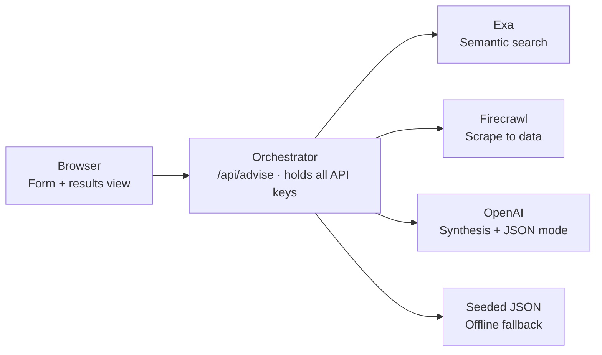
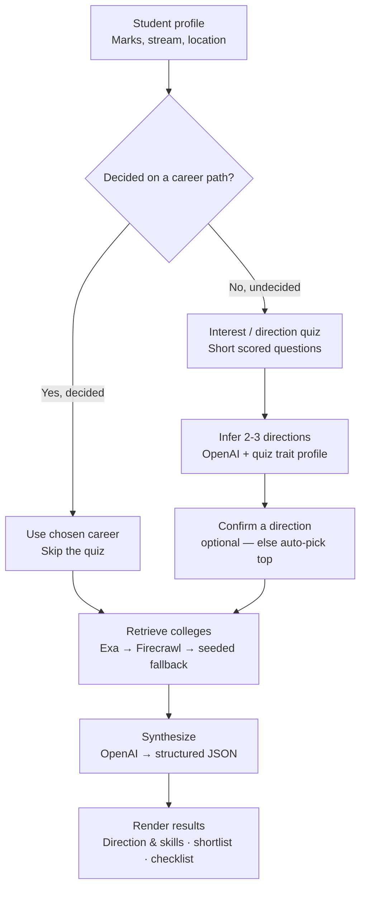

# PathFinder — Hackathon MVP Plan

**Build target:** Cursor India / Delhi build day · solo · ~3 hours clean build time · no prize
**Stack:** Cursor (build) · Exa (semantic search) · Firecrawl (scrape) · OpenAI (LLM) · Render (deploy, Web Service)
**Version:** final (branched flow)
**This build =** the discovery / triage layer of PathFinder. Verified-alumni reviews, paid 1:1 alumni/counsellor calls, and a validated psychometric battery are **documented roadmap, not built today.**

---

## 1. Scope

One scoped loop, single session, no auth:

**Profile in → { career + skills direction, live college shortlist, next-steps checklist } out.**

Cut hard (shown in the demo as roadmap only): alumni marketplace, identity verification, payments, bookings, video, accounts/login.

Honesty guardrail: this is an **AI discovery / triage tool**, not a "verified/honest" review platform. Don't let the demo claim what the artifact isn't — frame verified-alumni review as the roadmap.

---

## 2. System architecture

The whole app is one deployable unit. The browser holds no secrets; every API key lives only in the server-side orchestrator (`/api/advise`) as a Render environment variable.

- **Browser** — single page: input form + results view. No logic beyond rendering. Talks to exactly one endpoint.
- **Orchestrator** (`/api/advise`) — Next.js route handler running in the Render Web Service. The only place Exa / Firecrawl / OpenAI keys exist. Runs the whole pipeline.
- **Exa** — semantic search for right-fit colleges + current in-demand skills.
- **Firecrawl** — scrape the top 1–2 results into structured fields (fees, courses, cutoffs).
- **OpenAI** — the reasoning: interpret profile, then synthesize the final recommendation. Uses JSON mode.
- **Seeded JSON** — ~10 real colleges for the demo city, bundled in the repo. Every external call falls back here on failure.

> **LLM provider note:** the Cursor Pro subscription does **not** include API access — the deployed app calls OpenAI at runtime using your own OpenAI API key (you already have credit there). Keep it server-side in a Render env var, never in the client.

---

## 3. Runtime process flow (final — branched)

The decision gate is the **first** step after profile capture. A decided student skips the quiz entirely; an undecided student is routed through the counselling detour. Both paths converge at *Retrieve colleges*, so there is still only one synthesis-and-render path.

1. **Decision gate** — the branch runs before anything expensive. Decided → straight to retrieval. Undecided → quiz path.
2. **Quiz → infer → confirm** (undecided only) — short scored questions produce a trait profile; one OpenAI call infers 2–3 candidate directions from that profile plus marks and stream; the student optionally confirms one (else auto-pick the top).
3. **Retrieve colleges** — Exa semantic search filtered by stream + location + the chosen/inferred **direction** (relevant courses); Firecrawl enriches the top results; on any failure, fall back to seeded JSON.
4. **Synthesize** — one OpenAI call takes { profile, direction, retrieved colleges, skills signal } → returns one structured JSON object.
5. **Render** — three cards: direction & skills roadmap, ranked college shortlist (one-line rationale each), next-steps checklist. On the undecided path, include a short **"why this direction fits you"** line drawn from the quiz signals — this is the counselling payload.

**What makes the post-branch flow meaningful:** the *direction* (chosen or quiz-derived) is a first-class variable threaded through both later stages — it filters retrieval toward relevant courses and is referenced in every college rationale and in the skills roadmap. This is why the undecided path is guidance, not just a slower search.

**Confirm-step trade-off:** single-shot (auto-pick top direction, one request) is safest for 3 hours; interactive (return directions → student picks → second call) is more meaningful and more demoable. Build single-shot first; add the pick screen in polish if time allows.

---

## 4. The interest / direction quiz (undecided branch)

The quiz is now the explicit undecided branch in §3 — it strengthens counselling for the **undecided** student specifically. It is **input enrichment**, not new infrastructure: a handful of scored questions produce a small trait profile that feeds the *infer directions* call and the synthesis prompt.

- **Insertion point:** the undecided branch only — decided students never see it.
- **Honesty:** call it an *interest finder* or *direction quiz* — not "psychometric assessment." A short unvalidated quiz is not a validated instrument.
- **Positioning:** triage that feeds into a (roadmap) human counsellor session — not a replacement for it.
- **Priority:** build only if the polish stage has time. Not part of the spine.
- **Roadmap version:** a validated instrument (RIASEC / Big Five / aptitude), possibly licensed — a real differentiator vs advertising-driven rankings.

---

## 5. Load-bearing design decisions

- **JSON-only synthesis** — use OpenAI JSON mode / `response_format`; instruct the model to emit nothing but the object; parse defensively with a fallback shape. This is what keeps the UI from breaking on a chatty preamble.
- **One orchestrator endpoint** — everything happens inside `/api/advise`. No microservice mesh.
- **Fallback everywhere** — every external call wrapped; seeded data always ready. On shared venue wifi this is the difference between a demo and a blank screen.
- **The synthesis prompt is the product** — quality lives there. Write and test it tonight in a plain chat window before you're under time pressure.

---

## 6. Build order (each stage independently demoable)

| Time | Stage | Result |
|------|-------|--------|
| 0:00–0:30 | Scaffold form + results cards; `/api/advise` returns hardcoded JSON; deploy | Full loop live with fake data |
| 0:30–1:15 | Wire real OpenAI synthesis, fed by seeded college JSON | Recommendations genuinely reasoned; data local |
| 1:15–2:00 | Add Exa search; replace seeded data on success, fall back on failure | Colleges from live data |
| 2:00–2:30 | Layer Firecrawl enrichment on top results | Richer college detail (first thing to cut if behind) |
| 2:30–3:00 | Add undecided branch (quiz → infer → auto-pick); polish UI; rehearse with one locked persona | Demo-ready |

Sequencing logic: decided-path first (undecided added last), seeded data before live data — you are always building on something that already runs.

---

## 7. Prep tonight (highest-leverage window)

- Cursor installed, logged in, current version confirmed.
- OpenAI, Exa, Firecrawl keys in a notes file — copy-paste ready; same keys set in the Render dashboard.
- **Prove the pipeline:** scaffold a trivial app with one route handler returning "hello", and deploy it live to Render (Starter instance, Singapore region). If repo → build → live URL works early, the rest is features not plumbing.
- Seed the fallback JSON (~10 real colleges for the demo city).
- Write + test the synthesis prompt tonight (stack-agnostic).
- Lock the one demo persona you'll type live.
- Hotspot + charger + mouse.

---

## 8. Open decisions

- ~~Framework~~ **decided:** Next.js (App Router) + TypeScript + Tailwind, deployed as a Render Web Service.
- **Demo city** for the seeded dataset and live search.
- Whether to include the optional interest quiz (§4) tomorrow.
